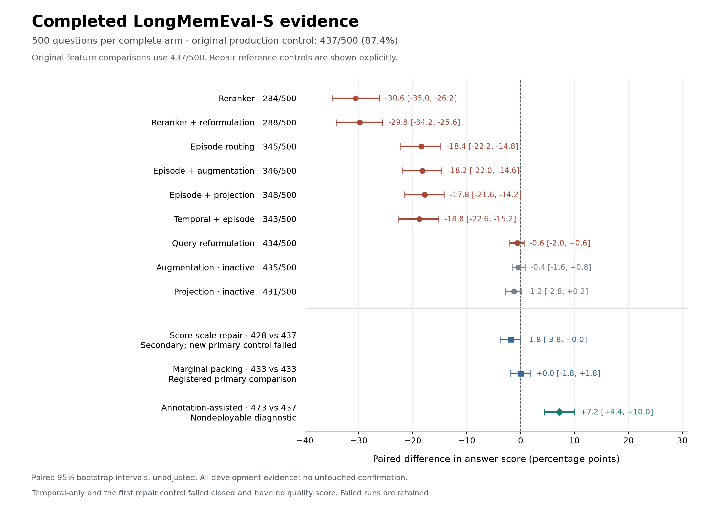

# Opt-in interaction study: corrected successor

**Date:** 2026-09-22. **Status:** execution in progress; this report distinguishes
complete comparisons from pending work. Production remains
`a66ee854325890c6bc28f6b515efeb6ed7df4deb`, with no default changes, deployment,
merge or push. Research branch: `research/opt-in-interactions-2026-09-22`.

## Completed comparisons at a glance

Every row below represents an authenticated full 500-question arm. Intervals
are registered paired 95% bootstrap intervals against the original baseline;
unfinished arms have no quality score. Context and latency details, category
scores, configuration hashes and artifact checksums are retained in the
[ten-arm analysis](opt-in-successor-v2-analysis-10-complete.json).

| Arm | Correct | Difference, percentage points | Interpretation |
|---|---:|---:|---|
| Production baseline | 437/500 | Reference | Fixed control; 403/470 complete annotated source sets |
| Episode routing | 345/500 | −18.4 [−22.2, −14.8] | Reject current unconditional default candidate; evidence displacement |
| Reranker | 284/500 | −30.6 [−35.0, −26.2] | Reject current composition; score-scale repair is under test |
| Query reformulation | 434/500 | −0.6 [−2.0, +0.6] | Only two changed contexts; extra latency without demonstrated benefit |
| Evidence augmentation | 435/500 | −0.4 [−1.6, +0.8] | Inactive on all 500 packs; score variation is not a feature effect |
| Evidence projection | 431/500 | −1.2 [−2.8, +0.2] | Inactive on all 500 packs; score variation is not a feature effect |
| Episode + augmentation | 346/500 | −18.2 [−22.0, −14.6] | Same contexts as episode routing; augmentation inactive |
| Reranker + reformulation | 288/500 | −29.8 [−34.2, −25.6] | Four changed inputs versus reranker; no changed-input answer gain |
| Episode + projection | 348/500 | −17.8 [−21.6, −14.2] | Same inputs as episode routing; projection inactive |
| Temporal + episode | 343/500 | −18.8 [−22.6, −15.2] | 32 temporal context changes, no changed-input answer transition versus episode alone |

The [vector figure](opt-in-completed-comparisons-v2.svg) and its
[input/output identities](opt-in-completed-comparisons-v2-identity.json)
are available for export. Intervals are unadjusted; the machine analysis also
retains the registered Holm-adjusted tests for the feature family.

Separately, the annotation-assisted diagnostic reached 473/500 (+7.2 points,
interval +4.4 to +10.0). It establishes a development opportunity for evidence
selection, not a deployable algorithm. The label-free reranker repair has completed its source trial and passed its
answer-follow-up gate. The marginal packing source trial is also complete;
only its bounded episode bonus qualified. Both have frozen 500-case control
repeats and candidate answer contexts. The reranker repair candidate completed
at **428/500**; its fresh control repeat failed, so its primary comparison is
unavailable. Its prespecified secondary comparison is −1.8 points [−3.8,0.0]
against the original baseline. It recovers much of the broken reranker's
regression but does not beat production. The marginal packing trial completed
at **433/500 versus 433/500** in its primary paired comparison: 0.0 points
[−1.8,+1.8], ten wins/ten losses. Its multi-session and preference gains were
offset by knowledge-update and assistant losses.
The figure distinguishes original-arm comparisons, secondary repaired-reranker
evidence, the marginal trial's primary comparison and the nondeployable diagnostic.

The temporal-only arm also failed closed: 265 completed cases, one truncated
reader response and 234 unstarted cases. It receives no answer score or
confidence interval. The [failure audit](opt-in-temporal-reader-failure-v1.json)
shows that the failed request was identical to the original successful control
request; temporal validation had returned the unchanged control context.
The reader exhausted all 8,192 output tokens while looping. The separate rank
control repeat failed on this same request after 274 completed cases. Both
failed runs and their costs remain in the
[provider ledger](opt-in-finalized-provider-failures-v1.json), including the
temporal arm's separately recovered HTTP 502. Neither failure is a negative
answer-quality finding about a retrieval feature, and neither run is replaced.

## Question and repaired protocol

Which experimental features improve PRME's answers at a fixed memory budget,
and which failure mechanisms should subsequent development address? The goal is
trustworthy memory with reproducible, held-out quality advantages, not a larger
score obtained by weakening provenance or discarding inconvenient runs.

The [original failed study](OPT-IN-INTERACTIONS-REPORT.md) remains intact. Its
reader exhausted the 1,024-output-token limit; its incomplete results support
neither a quality comparison nor a recommendation against changes. The user
authorized implementing repairs and continuing the experiment.

The [successor protocol](OPT-IN-SUCCESSOR-PROTOCOL.md) and
[machine registration](opt-in-successor-v2-registration.json) freeze a common
8,192-output-token allowance for control and treatment, all 500 LongMemEval-S
questions, exact official prompts/scoring, a 4,096-token memory budget with 100
reserved tokens, and the user-selected Ollama `deepseek-v4.1-flash:cloud` reader
and judge. The model tag/digest, temperature 0, seed 42, thinking disabled and
65,536 model context are recorded. The hosted alias does not guarantee immutable
weights. These results are not directly comparable to prior Qwen or GPT scores.

Each arm requires all 500 cases plus authenticated contexts, requests, durable
receipts and pack hashes before it receives a score. Terminal failures invalidate
the entire arm; the artifacts remain and other prespecified arms continue.
Historical retrieval arms reuse immutable source packs through private copies.
Store-time arms use fresh actual sequential ingestion and a separate fresh
control, with matched research fixture IDs and admission clocks. Their cost
includes every nonempty source turn. The [scheduling amendment](opt-in-successor-scheduling-amendment-v2.json)
allows independent fresh packs to run concurrently; latency and ingestion wall
times are measured under shared load, not as isolated serving performance.
After the packing diagnostic completed, a [second retrieval lane](opt-in-successor-scheduling-amendment-v3.json)
reused its available provider capacity for the already registered reranker,
reformulation and temporal arms. No cases or scoring rules changed.
The [fourth scheduling amendment](opt-in-successor-scheduling-amendment-v4.json)
starts the already fixed full-feature ingestion independently, raising the fresh
process cap from four to five after a host-capacity check. Only its idle waiting
launcher was stopped; no benchmark case or worker was interrupted.

## Completed production control

The [authenticated baseline](opt-in-successor-v2-analysis-01-complete.json)
scored **437/500 (87.4%)** with zero terminal provider failures. Context use
averaged 3,964.75 tokens (p50 3,976; p95 3,996). Cold retrieval p50/p95 was
0.621/2.346 seconds; immediate warm p50/p95 was 0.590/2.769 seconds. Historical
ingestion cost is reused and explicitly distinguished from fresh ingestion.

| Category | Correct / total |
|---|---:|
| Single-session user | 69/70 |
| Single-session assistant | 53/56 |
| Single-session preference | 27/30 |
| Multi-session | 100/133 |
| Temporal reasoning | 115/133 |
| Knowledge update | 73/78 |
| Abstention, overlapping the above categories | 25/30 |

Among the 63 incorrect answers, 44 had all annotated turns among returned
candidates but lacked some in the packed context, 14 contained complete
annotated evidence, and five abstention questions had no applicable source
annotation. All required annotated turns appeared in 403/470 applicable packed
contexts. A separate [source-literal audit](opt-in-source-literal-baseline.json)
checked that whole original source text, rather than just a node ID or reference,
was present; it confirmed these counts. An annotation match does not establish
semantic sufficiency or prove that the reader alone caused a miss.

## Complete episode-routing comparison

The [complete episode arm](opt-in-successor-v2-analysis-02-complete.json), with
two episodes and eight local records per episode, scored **345/500 (69.0%)**:
eight paired wins, 100 losses, **−18.4 points**, and a paired 95% bootstrap
interval of **−22.2 to −14.8 points**. Its Holm-adjusted discordant-pair p-value
is `3.06e-20` in the full registered family, retaining the slots of unfinished
comparisons. There were no provider failures or retries.

Complete annotated evidence fell from 403 to 283 of 470 applicable cases, with
131 new complete-evidence losses. Multi-session answers fell by 45, temporal
answers by 32, preferences by nine, knowledge updates by seven and user facts
by one; assistant answers improved by two and abstention stayed tied. Memory
use averaged 3,960.27 tokens, so the regression did not arise from a smaller
configured budget. Cold retrieval p50/p95 was 1.398/8.138 seconds under shared
load; this is not a controlled serving-speed comparison.

**Reject this unconditional episode policy as a production-default candidate
on this cohort.** This does not reject caller-scoped episode routing in every
task. The [earlier source-only grid](../2026-09-18/LONGMEMEVAL-S-EPISODE-COMPOSITION-V1.md)
already found the same 403→283 coverage transition; the present trial adds
matched-reader answer evidence. Inspection confirms that the packer reserves
routed episode records ahead of the ordinary multi-path pool. Simply changing
the inherited-score decay would not remove that priority tier.

## Complete episode-plus-augmentation interaction

The [complete interaction arm](opt-in-successor-v2-analysis-07-complete.json)
scored **346/500**, ten wins and 101 losses versus production: **−18.2 points**,
paired 95% interval **[−22.0, −14.6]**, Holm-adjusted p-value `4.84e-19`.
Complete source-node coverage remains 283/470, with 131 new complete-evidence
losses. Mean context use is 3,960.268 tokens; cold retrieval p50/p95 is
2.628/12.037 seconds under shared load. All 1,000 reader/judge calls completed
with zero recorded errors or retries.

The [input applicability audit](opt-in-episode-augmentation-applicability-v1.json)
found all 500 contexts and reader requests byte-identical to episode routing,
with zero evidence operations. Its five wins and four losses against the episode
arm therefore measure reader/judge variation. The registered secondary factorial
contrast is +0.6 points, interval [−1.2, +2.4], but inactive augmentation prevents
interpreting this as evidence of feature synergy. The routing regression persists;
this combination is rejected as a default candidate on this cohort, and the
intended augmentation mechanism remains untested on these raw-turn packs.

## Complete neural-reranker comparison

The [authenticated reranker arm](opt-in-successor-v2-analysis-03-complete.json)
scored **284/500 (56.8%)**, with nine wins and 162 losses against the fixed
437-answer control: **−30.6 points**, paired 95% interval **−35.0 to −26.2**,
and Holm-adjusted p-value `2.56e-36`. All 1,000 reader/judge calls completed
without provider errors or retries. Complete annotated evidence fell from 403
to 224 of 470 applicable cases, with 182 new complete-evidence losses.
Multi-session answers fell by 51, temporal by 71, preference by 15, updates by
eight, and user and assistant categories by four each; abstention improved by
two. Cold retrieval p50/p95 was 7.748/15.077 seconds under shared load, and
mean context use was 3,957.824 tokens.

**Reject this current reranker composition as a default candidate.** This is
not evidence against all neural ranking. Code inspection identifies a score
scale mismatch: the top 100 candidates are blended with neural scores while
the tail keeps original scores. Session expansion can then sort both groups
together, and packing compares their scores again. A
[descriptive audit](opt-in-reranker-score-scale-audit-v1-result.json) of all
500 frozen captures found 8,025 of 10,901 packed records had no neural or
inherited-neural adjustment; only four of those records were annotated turns.
Among 860 annotated turns with a neural or inherited-neural adjustment, 432
were omitted. These counts motivate an isolated score-scale repair, not a
claim that the proposed repair has already improved answers. The failed arm
and the existing interaction matrix remain unchanged.

The [repair study](RERANKER-SCORE-REPAIR.md) is isolated on
`research/reranker-score-repair-2026-09-22`, implemented at `6f98acd` with the
scheduling derivative at `06a464d`. Its private research
class places the neural-ranked prefix back on the original prefix's score
range, preserves raw model scores and adds an explicit replayable assignment.
There is no new public feature flag or default. All 97 relevant tests passed
with one expected backend-specific skip, including live DuckDB/PostgreSQL
receipt restart and old-byte compatibility. Its
separate [installed-wheel validation](rank-envelope-installed-validation-v1.json)
passed the same 97 tests with one expected skip and confirmed all 163 packaged
Python files match the frozen repair sources. These are overlapping targeted
checks, not 194 distinct tests or a complete release certification. Its
[registration](opt-in-rank-envelope-v2-registration.json) fixes complete
500-case baseline/legacy replay and a conditional paired answer trial. Its [complete source trial](opt-in-rank-envelope-v2-source-result.json)
reproduced all 500 original controls and found complete verbatim source sets in
407/470 repair cases, versus 403 baseline and 223 original reranker. The baseline
paired gain is +0.85 points, descriptive 95% interval [−0.64, +2.34]; against
the broken reranker it is +39.15 [34.68, 43.62]. Baseline category retention
improves by four multi-session and two update cases but loses two assistant
cases. The small baseline advantage is uncertain and is not an answer win.
The original reranker node-presence count of 224 includes one metadata-only
representation without source text; both metrics remain reported.

Both source gates passed and the two full 500-context reader registrations are
frozen. Hosted answers still wait for the original historical matrix. A tested,
registered handoff stopped only the completed idle source process to release
retained JSON; the replacement coordinator reauthenticates the contexts and
uses the unchanged answer code and gate. Initial orchestration refusals are
retained and involved no benchmark calls. The initial version-1 waiter had
also been withdrawn before any case under its scheduling-only amendment.
The registration, results and validation files here are exact exports from
the separate repair branch, not a merge of its package changes.

The [full-cohort source/error cross-tabulation](opt-in-repair-source-error-bridge-v1.json)
shows that five of the baseline's 44 packing-omission errors acquire complete
source sets under the repair; one other gains some source turns. Three other
complete-source gains occur in already-correct baseline cases. The repair also
loses complete source in three already-correct cases and one baseline error that
previously had complete annotations. It changes 345 already-correct and 38
incorrect-answer contexts in total. These associations identify an opportunity
and regression exposure; they are not repaired answer scores. Most baseline
packing omissions remain, so fixing the integration defect alone does not yet
establish a solution to the broader evidence-selection problem.

A subsequent [released-lane scheduling amendment](opt-in-answer-lane-scheduling-v1.json)
now allows the frozen repair answers to start after the first historical lane's
six arms settle/authenticate and its coordinator exits, while the second lane
continues. It preserves the same provider-process ceiling and runs rank before
any eligible marginal follow-up, one four-slot reader process at a time. Six
ownership/gating tests passed. The previous waiting coordinator was transferred
only while idle after all 500 contexts were reauthenticated; no answer case
had started. This supersedes the original all-eleven-arm wait, with no change
to source gates, contexts, readers, scoring or failure handling.

## Development error review

The [complete query-reformulation arm](opt-in-successor-v2-analysis-06-complete.json)
scored **434/500**, with four wins and seven losses: **−0.6 points**, paired
95% interval **[−2.0, +0.6]**. It made 1,000 nonempty reformulation calls
across first and repeated retrievals, yet changed only two reader contexts.
All 11 answer disagreements were on unchanged contexts. Complete annotated
evidence remained 403/470, with no new complete-evidence losses; no measured
answer gain can be attributed to its two changed inputs. All reader/judge calls
completed without errors or retries. Mean context use was 3,964.684 tokens.
Cold retrieval p50/p95 was 6.569/12.519 seconds; the paired median latency
increase was 5.533 seconds under shared load.

**Reject the current reformulation policy as a default candidate on this
cohort's cost/benefit evidence.** It remains opt-in for tasks where candidate
discovery is incomplete. The implementation appends only previously unseen
node IDs; it discards alternate-query scores and path evidence for existing
candidates. The baseline already returned every annotated turn. A future
ranking-fusion hypothesis would need to retain and validate alternate-query
support for existing candidates, with auditable scoring and displacement
checks. This trial does not establish that such a change will improve answers.

The [complete reranker-plus-reformulation arm](opt-in-successor-v2-analysis-08-complete.json)
scored **288/500**, seven wins and 156 losses against production: **−29.8 points**,
paired 95% interval **[−34.2, −25.6]**, Holm-adjusted p-value `1.24e-36`.
Complete source-node coverage remains 224/470, with 182 new complete-evidence
losses versus baseline. Mean context use is 3,957.808 tokens; cold retrieval
p50/p95 is 13.630/27.657 seconds under shared load. All 1,000 reader/judge calls
finished without errors or retries, alongside 1,000 nonempty reformulation calls.

Its [paired input audit](opt-in-reranker-reformulation-inputs-v1.json) found
only four changed contexts relative to reranking alone. All four retain their
answer scores; eight wins and four losses occur entirely under unchanged inputs.
The registered factorial contrast is +1.4 points, interval [−0.4, +3.2], but it
does not establish a useful interaction. Reformulation does not repair the
current reranker's evidence displacement. Reject this composition as a default
candidate on this cohort; the separate score-scale repair remains under test.

The representative review used the first four question IDs by SHA-256 ordering
within each of the three baseline error classes. It did not rescore examples or
select a favorable evaluation subset. This is qualitative development analysis.

* Missing packed evidence includes a property count missing a rejected property
  (`gpt4_7fce9456`), a latest subscription missing the relevant update
  (`gpt4_2f56ae70`), a song answer using a different song's material (`eaca4986`),
  and a dated business milestone without the relevant source (`eac54add`).
* Complete-source errors include an omitted associate degree when totaling
  education (`gpt4_372c3eed`) and selection of an incorrect star-count update
  (`0f05491a`). Two examples expose reference/source qualification issues: a
  future storage plan versus the current shoe location (`07741c45`), and an
  approximate follower count versus an exact earlier count (`a2f3aa27`). The
  official scores remain unchanged; these are not reasons to collapse future
  plans into current truth or approximations into exact quantities.
* Abstention failures include a job-title mismatch (`031748ae_abs`), an unstated
  cow purchase (`gpt4_70e84552_abs`), treating generic bus-fare advice as the
  user's actual fare (`09ba9854_abs`), and answering a football question from
  baseball evidence despite noticing the mismatch (`0ddfec37_abs`).

The immediate development priorities are evidence coverage during packing,
reasoning over complete source sets, and preserving the distinction between the
question's premise and the facts actually supported by memory. A retrieval win
cannot by itself fix every reader error or annotation ambiguity.

The complete [descriptive omission audit](opt-in-baseline-omission-audit-v1-result.json)
narrows the first priority. Of 886 annotated turns, 94 were missing from packed
context although all were returned. The 70 missing turns associated with
incorrect answers had median final rank 75, versus rank six for annotated turns
present in incorrect-answer contexts. Their median source length was only 66
tokens, versus 64 for the present group; these are raw content lengths, not
serialized entry costs. Sixty-seven of the 70 missing turns were user messages,
and 37 had another record from the same session already packed. Thus blanket
compression or broader session coverage would not directly address the main
observed pattern. Better query-to-evidence ranking and selective recovery of
related turns are more specific hypotheses. These are post hoc associations,
not evidence that a particular ranking change will improve answers.

## Applicability and separate diagnostics

The [source audit](opt-in-source-applicability-result.json) found 246,738 nodes
with event provenance but no graph-node evidence references in these raw-turn
packs. Evidence projection and augmentation need graph-node references to route
source passages. Their individual arms are now complete, but an inactive flag cannot
establish benefit or harm for the intended derived-claim workflow. A meaningful
test of that workflow needs a separately matched derived-ingestion study.

The [complete augmentation arm](opt-in-successor-v2-analysis-04-complete.json)
scored 435/500, with four paired wins and six losses: −0.4 points and a paired
95% interval of −1.6 to +0.8 points. All 500 contexts were byte-identical to
the baseline and no evidence operation activated. All ten answer-score
disagreements therefore occurred under unchanged reader inputs; they cannot
be attributed to augmentation. This is an inapplicable feature test and a
registered reader-variation observation, not evidence for or against the
intended source-augmentation workflow.

The [packing diagnostic registration](opt-in-packing-oracle-v1-registration.json)
deliberately uses evidence annotations in an offline selector. It prioritizes
whole annotated source turns already present among returned candidates, retains
the original remainder when space permits, and obeys the same 3,996-token
effective limit. All 67 incomplete annotated source sets fit; the other 433
contexts remain byte-identical repeats. All 500 questions are evaluated, whether
the original answer was right or wrong. This diagnostic is not deployable
retrieval, an achievable upper bound, or a member of the promotion matrix.
Annotations and reference answers never enter PRME retrieval, temporal relation
providers or Jev.

The [complete authenticated diagnostic](opt-in-packing-oracle-v1-result.json)
scored **473/500 (94.6%)**, versus 437/500 for the primary baseline: 44 paired
wins, eight losses, and a **+7.2-point difference (95% paired bootstrap interval
+4.4 to +10.0 points)**. All 1,000 reader/judge requests completed without a
retry. Mean memory context was 3,959.22 tokens. This estimates a development
diagnostic difference, not a deployable feature gain.

| Input group | Baseline | Diagnostic | Wins / losses |
|---|---:|---:|---:|
| 67 changed contexts | 23/67 | 62/67 | 42 / 3 |
| 433 byte-identical repeated contexts | 414/433 | 411/433 | 2 / 5 |

Most of the gain is concentrated where the selector added missing evidence.
The unchanged inputs demonstrate residual reader/judge variation even with
temperature 0 and a fixed seed. The three changed-context losses show that
annotated evidence priority is not universally beneficial. Category totals were
user 70/70, assistant 56/56, preference 29/30, multi-session 119/133, temporal
128/133 and knowledge-update 71/78; abstention remained 25/30. The two-answer
knowledge-update decline must remain visible alongside the overall gain.
The result supports developing label-free context selection while preserving
source qualifiers and testing displacement losses. It does not authorize a
default change or allow replacing the original baseline with a favorable repeat.

All three changed-context answer losses were reviewed: `gpt4_2f8be40d` counted
an additional sister's wedding, `bf659f65` declined to infer a purchase from a
signed vinyl record, and `59524333` preferred an older explicit 7 pm gym schedule
over a newer explicit 6 pm schedule. The added/removed source records remain
available in the private artifacts. These examples distinguish distractor,
annotation and update-reasoning risks; they do not establish a single cause for
every score transition.

The follow-up [marginal packing assay](opt-in-marginal-packing-v2-registration.json)
implements the previously proposed change in a research module: original
candidate relevance, a bounded episode bonus, diminishing weight for additional
same-session records, and the unchanged whole-source serializer/budget. It
preserves instruction/pin priorities and the baseline's leading multi-path
anchor. Three fixed policies face all 500 source cases. A policy advances only
with gains in both complete source sets and mean source fraction; all category
and per-question losses remain reported. If one qualifies, a separately frozen
500-case candidate answer trial and a new 500-case baseline-context repeat form
the primary follow-up comparison. No production source or default is modified.

The [version-2 scheduling amendment](opt-in-marginal-scheduling-amendment-v2.json)
starts this local source assay before the remaining hosted historical arms
finish. The version-1 waiter was stopped before any source case or answer call.
Policies, evaluator, cohort and selection criteria are unchanged; the original
historical-stage wait now occurs after any qualifying contexts are frozen and
before hosted answer generation. This adds no hosted-provider concurrency.

Prior negative work also constrains this follow-up. The earlier
[session-marginal source grid](../2026-09-18/LONGMEMEVAL-S-SESSION-MARGINAL-V1.md)
found that broadening session coverage displaced necessary turns, and its mild
arm's [answer diagnostic](../2026-09-18/LONGMEMEVAL-S-SESSION-MARGINAL-ANSWER-V1.md)
tied 25/31. The present three-policy assay is an incremental development test,
including a query-dependent bounded local-relevance bonus and whole-source
selection; session diversity itself is not a new or established remedy. These
prior reports were reviewed in detail after the new registration but before
its waiting launcher had evaluated any cases. They do not change its frozen
selection or reporting rules. A negative full-cohort source result ends this
follow-up without another parameter search or an answer trial.

The [complete marginal source trial](MARGINAL-PACKING-STUDY.md) now finds
403/470 complete source sets for control, 300 for the session penalty, 407 for
the bounded episode bonus, and 319 for both. The two session-penalty policies
fail the fixed gate and receive no answer trial. The bonus-only policy gains
six complete sets and loses two: +0.85 points, descriptive interval [−0.21,+2.13].
It improves three baseline packing-omission errors, changes 495/500 contexts
and averages 3,961.962 memory tokens. Every category and source loss is retained.
Its full 500-case control repeat and candidate subsequently tied 433/500,
with ten wins/ten losses and a primary interval of [−1.8,+1.8] points. The
small source gain did not become an overall answer gain; the complete
[marginal report](MARGINAL-PACKING-STUDY.md) retains all category regressions
and provider costs. The completed source process was transferred
only while idle, without interrupting any case or increasing provider capacity.

The [additional combination plan](opt-in-exploratory-combination-plan.json)
separates experimentation from promotion. It preserves the original strict
gated selection, while adding an exploratory combination of the two best
observed active individuals after all eight have valid matched comparisons.
Negative differences remain eligible for that explicit exploratory test; failed
arms cannot simply be omitted and inactive unchanged-input flags cannot win on
reader noise. The rule was frozen before inspecting any completed individual
candidate answer result. Duplicate configurations are aliases, not new replicates.

The [secondary analysis plan](opt-in-successor-secondary-analysis-registration.json)
also compares unchanged-input repeat arms and estimates the four registered
factorial contrasts. Reader/judge variation never replaces the primary baseline.

The [complete episode-input audit](opt-in-episode-repeat-inputs-v1.json) confirms
that episode routing, episode + augmentation and episode + projection have
identical reader requests for every question, with no evidence operation.
Their 345, 346 and 348 correct answers therefore do not establish an evidence
interaction. Across those three fixed repeats, 338 questions always passed,
145 always failed and 17 changed outcome. The registered episode/projection
factorial contrast is +1.8 points [−0.2,+3.8], reported descriptively in the
[nine-arm secondary analysis](opt-in-successor-secondary-analysis-09-complete.json).
The temporal factorial contrast is unavailable because one required arm failed.
The best-two selection likewise cannot discard the failed temporal individual
and select from a favorable subset; it waits for the remaining arms to settle
and must retain the missing-comparison outcome.

The [complete projection arm](opt-in-successor-v2-analysis-05-complete.json)
scored **431/500**, with four wins and ten losses: **−1.2 points**, paired
95% interval **[−2.8, +0.2]**. All 500 contexts were unchanged and no evidence
operation activated. Source completeness and context-token use were identical
to baseline. Cold retrieval p50/p95 was 0.786/6.548 seconds under shared load;
all 1,000 reader/judge requests completed with no errors or retries. This is
inapplicability on these artifacts, not evidence of projection damage.

The [registered repeated-input analysis](opt-in-successor-secondary-analysis-05-complete.json)
confirmed identical reader requests across baseline, augmentation and
projection. Their scores were 437, 435 and 431 out of 500. Of the 500 questions,
422 passed all three times, 58 failed all three times, and 20 changed outcome.
Pairwise disagreement counts were 10, 14 and 16. This quantifies the reader/judge
variation that small candidate gains must survive. The secondary pooled score
is 86.87%; the primary baseline remains the original 87.4%. No response is
selected or replaced, and these repeated inputs cannot serve as feature wins.

After the marginal control completed, a separate
[four-control audit](opt-in-complete-control-repeats-v1.json) authenticated the
same reader request for every question across all four complete controls.
Scores were 437, 435, 431 and 433; 417 questions passed every time, 58 failed
every time, and 25 varied. The additional failed rank-control repeat remains
unscored in the audit. No pooled estimate or favorable repeat replaces any
primary baseline. Question-bootstrap intervals do not capture all possible
remote-provider drift.

A complete-cohort [post hoc persistence audit](opt-in-stable-errors-v1-result.json)
classifies the 58 consistently incorrect cases: 43 lack some annotated packed
evidence, 11 contain the complete annotation set, and four are abstention
questions without source annotations. Thirty-one are multi-session questions
and 18 are temporal. This strengthens the priority of selective evidence
retention across sessions and time. It does not isolate reader from judge
errors, prove semantic sufficiency, or create a smaller evaluation cohort.

Temporal relations retain the documented answer-blind Ollama/TypeSafe Jev
protocol. Product alignment/Jev remains a separate caller-selected pair and
explicit review workflow; its authored operational probe is not retrieval or
held-out semantic-quality evidence.

The completed temporal + episode arm scored **343/500**: seven wins/101 losses
against production, −18.8 points [−22.6,−15.2], Holm-adjusted p `2.03e-21`.
It retained 283/470 complete annotated source sets, averaged 3,955.554 context
tokens and measured cold p50/p95 2.667/11.341 seconds under shared load. Its
1,000 reader/judge calls had no HTTP errors or retries and used 2,243,428 input
and 127,002 output tokens. The combination remains a rejected default candidate.

The separate [conditional audit](opt-in-temporal-episode-audit-v1.json) compares
it with the complete episode-only arm: two wins/four losses, −0.4 points
[−1.4,+0.6]. All six score transitions occurred among 468 unchanged reader
inputs. The 32 accepted changed contexts had 28 correct and four incorrect
answers in both arms. Every temporal control-context hash matched episode
routing. Cold status counts were 355 not invoked, 70 validation rejected,
29 unsupported, 14 gate rejected and 32 accepted. All observed executions
retained the documented protocol and 0.85 gate. The full four-arm factorial
estimate remains unavailable because temporal-only failed.

Across the cold and warm observations, the resolver ran 290 operations with
301 attempts, and Jev ran 90 operations/attempts. Their recorded usage adds
1,082,588 input and 41,002 output tokens to the reader/judge usage above;
all token fields were available. These are study token counts, not dollar
costs or isolated serving measurements. Twelve cold/warm contexts differed.
The [review of all four accepted errors](opt-in-temporal-accepted-error-review-v1.json)
includes incomplete question coverage (two of three requested events, and only
one education duration) and date/reference discrepancies despite consistent
arithmetic. Acceptance validates bounded operands and repacking; it is not a
proof of complete query coverage or truth. No benchmark label or protocol was
changed on this review.

## Validation and remaining work

A [memory-bounded analysis wrapper](opt-in-analysis-memory-amendment-v1.json)
retains the original authentication, metrics and selection functions while
releasing unused capture details between arms. Its results matched every
numerical output of the original four-arm analysis exactly. Only idle analysis
and selection launchers were replaced; benchmark workers and their inputs were
unchanged. The original outputs and parity artifacts remain available.

A separate [completed-source memory handoff](opt-in-answer-memory-amendment-v1.json)
passed seven authored checks. It can release a completed source worker's large
snapshot arrays while retaining the original historical-stage wait. It requires
all 500 authenticated source cases, both frozen context registrations and zero
started reader cases; it then uses the exact execution/analysis portion of the
registered answer function. It changes no provider capacity, source selection,
contexts or scoring. Any actual idle-process transfer is recorded separately.

The corrected ingestion harness passed 13 tests, and the source-priority
diagnostic passed five tests. Authored reranker and reformulation provider
preflights passed; these establish operability, not benchmark benefit. A separate
local PostgreSQL 16.11 test database ran 59 backend tests with no skips. The
feature/recovery suite then ran 152 tests with three backend-specific skips.
These are source-checkout checks, not a completed installed-package release gate.

The remaining fixed feature matrix and fresh-ingestion arms are still running. Paired
10,000-draw question/source-cluster intervals, category regressions, evidence
losses and Holm-adjusted discordant-pair tests will be reported for complete
matched comparisons. Best-arm combination selection waits for every individual
arm and its matched control; the full-feature arm is exploratory. No arm is
currently recommended for promotion on this unfinished evidence. The tested
unconditional episode policy has a completed negative finding.

MemoryAgentBench Banking, EventQA, Conflict and Detective inputs have been
prepared with the prior registered preprocessing pins. The [MAB matrix](opt-in-mab-matrix-v1-registration.json)
binds 100 Banking, 500 EventQA, 100 Conflict and 71 Detective questions. All
eight authored reader checks and nine harness checks passed; initial harness
test failures and repairs are retained in the [validation record](opt-in-mab-validation.json).
The [stage launcher](opt-in-mab-launch-plan.json) waits for LongMemEval and its
combination to finalize. If the selected combination has a new configuration,
a child registration adds it before any MAB inference. BEAM and MemoryArena
remain later stages. None of the 500
LongMemEval histories qualifies as untouched confirmation; promotion requires a
separately audited unused source cohort and relevant release/backend regressions.
No production-default decision is authorized by this study alone.

One fixture detail is explicit in the validation record: LongMemEval matches
source-node clocks and `Event.created_at`, while the separate immutable
`Event.timestamp` records actual admission time. The registered graph retrieval
does not use that field. The new MAB fixture matches both event clocks as well;
the already running LongMemEval execution was not rewritten.

An additional [authored fault check](opt-in-active-failure-observer-audit-v1.json)
confirmed that the exact frozen independent worker observes a vector exception
before store supersedence's internal catch. It appends the error to the case's
existing fail-closed gate. Both active flag-bearing arms and queued MAB use
this worker observer. An initial concern came from testing the older
coordinator-only observer instead; the [audit resolution](opt-in-observer-audit-resolution-v1.json)
records that correction and withdrawal of an unused duplicate observer draft.
No benchmark failure was injected, no running job or registration changed,
and no actual unobserved failure is inferred from the initial probe.

The [completed reranker repair report](RERANKER-SCORE-REPAIR.md) retains the
failed primary comparison and the complete 428/500 candidate separately.
Source gains produced three answer wins, but source losses produced three
answer losses; complete-source coverage alone did not predict a net quality
gain. The repair's changed contexts had five wins/nine losses, and unchanged
contexts had two wins/seven losses. This motivates protecting required details
and investigating ranking/reader behavior, rather than promoting the repair
from its recovery over the broken reranker. All categories and provider costs
are in the complete child artifact; no failed control or unfavorable case was
replaced.

A separately registered [original-anchor refinement](opt-in-anchored-rank-v1-registration.json)
now tests one further development policy across all 500 source cases. It puts
the original balanced-packing anchor first when assigning the neural prefix's
existing score values; other candidates retain neural order and UUID ties.
This addresses the observed loss of two leading assistant sources without
using annotations in ranking. Nine authored checks passed, including actual
packing/receipt replay and an end-to-end source executor that rejects drift.
It uses cached identical neural inputs and adds no source inference. It
advances only if both source metrics beat production and the previous repair,
with no category source-count regression versus production. Any qualifying
answers use a new complete paired trial in the released lane. This new variant
does not replace either completed repair trial or its failures.
